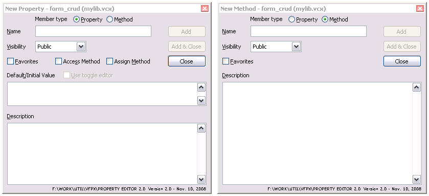

# New Property/New Method Replacement

**Replacement for the native VFP dialog used to create properties and methods.**  

Project Manager: [Doug Hennig](mailto:dhennig@stonefield.com)

One thing many VFP developers have always wanted to do was replace the New Property and New Method dialogs. This project provides that capability.  

The benefits of the New Property and New Method replacement dialogs, which was written by Doug Hennig, are:

*   It automatically updates the _MemberData property (adding that property if necessary) so the case entered for the new member is used (even for access and assign methods if they're created as well) and the member is displayed on the Favorites tab if that option is turned on in the dialog.

*   It's non-modal. That means you can keep it open, add some properties or methods, switch to other things, come back, and add some more members.

*   How many times have you accidentally selected the wrong dialog, entered the name and description, only to realize your mistake and have to close the dialog and start all over? With the replacement dialog, you can switch between Method and Property without closing the dialog.

*   It's dockable: try tab-docking it with Properties window.

*   It's resizable and persists its size and position to your resource (FOXUSER) file.

*   It has an Add & Close button to perform both tasks with one click.

*   The default value for a property is automatically set to a value based on the data type of the property if you use Hungarian names. For example, lTest would be logical, so the default value is .F. For nTest, the default is 0.

*   For logical properties (those with a default value of .T. or .F.), turning on the Use Toggle Editor option installs a property editor that allows you to double-click the property in the Properties window to toggle its value.

*   It hides rather than disables non-applicable controls. Since this one dialog is used for both New Property and New Method for both the Class and Form Designers, some options may not be applicable for a given instance.

*   It disallows invalid names when you enter them rather than when you click on Add or Add & Close.

*   The Add buttons are only enabled if a name is entered.
